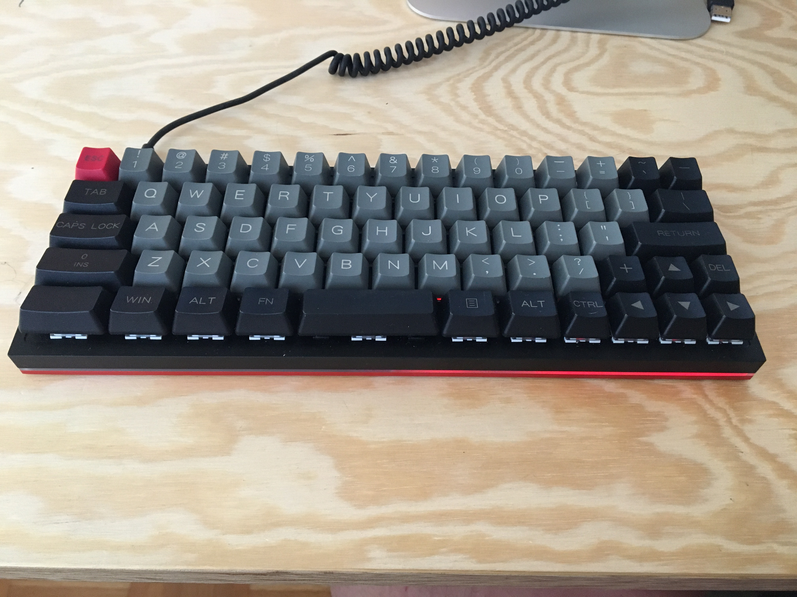

# Projects List

## YD60MQ Minila

This is my home board. I use it when I work from home and on hobby projects. This is my first ever build.

[Keyboard Layout](http://www.keyboard-layout-editor.com/#/gists/bdaadc157e4dcffb2c719172b84a76ea)

<table>
    <tr>
        <th>Part</th>
        <th>Purchased</th>
        <th>Installed/Built</th>
        <th>Notes</th>
    </tr>
    <tr>
        <td>PCB</td>
        <td style ="color: green">&#x2714;</td>
        <td style ="color: green">&#x2714;</td>
        <td> 
            <ul>
                <li>Hot swap sockets </li>
                <li>RGB Underglow</li>
                <li>QMK</li>
            </ul>
        </td>
    </tr>
    <tr>
        <td>Plate</td>
        <td style ="color: green">&#x2714;</td>
        <td style ="color: green">&#x2714;</td>
        <td>Built into the case</td>
    </tr>
    <tr>
        <td>Switches</td>
        <td style ="color: green">&#x2714;</td>
        <td style ="color: green">&#x2714;</td>
        <td>Kailh Box Royal</td>
    </tr>
    <tr>
        <td>Stabilizers</td>
        <td style ="color: green">&#x2714;</td>
        <td style ="color: green">&#x2714;</td>
        <td>Not Genuine</td>
    </tr>
    <tr>
        <td>Case</td>
        <td style ="color: green">&#x2714;</td>
        <td style ="color: green">&#x2714;</td>
        <td></td>
    </tr>
    <tr>
        <td>Keycaps</td>
        <td style ="color: green">&#x2714;</td>
        <td style ="color: green">&#x2714;</td>
        <td>Not quite the right set for this layout. It is an OEM profile PBT Dolch set. Will be ordering a DSA Dolch set</td>
    </tr>
</table>

## XD87 TLK Work board

<table>
    <tr>
        <th>Part</th>
        <th>Purchased</th>
        <th>Installed/Built</th>
        <th>Notes</th>
    </tr>
    <tr>
        <td>PCB</td>
        <td style ="color: green">&#x2714;</td>
        <td style ="color: green">&#x2714;</td>
        <td>Arrived.</td>
    </tr>
    <tr>
        <td>Plate</td>
        <td style ="color: green">&#x2714;</td>
        <td style ="color: green">&#x2714;</td>
        <td>Arrived</td>
    </tr>
    <tr>
        <td>Switches</td>
        <td style ="color: green">&#x2714;</td>
        <td style ="color: green">&#x2714;</td>
        <td>Gateron Blacks (lubed)</td>
    </tr>
    <tr>
        <td>Stabilizers</td>
        <td style ="color: green">&#x2714;</td>
        <td style ="color: green">&#x2714;</td>
        <td>Arrived, GMK screw in.</td>
    </tr>
    <tr>
        <td>Case</td>
        <td style ="color: green">&#x2714;</td>
        <td style ="color: green">&#x2714;</td>
        <td>Arrived</td>
    </tr>
    <tr>
        <td>Keycaps</td>
        <td style ="color: green">&#x2714;</td>
        <td style ="color: green">&#x2714;</td>
        <td>Amazing set of DSA blanks</td>
    </tr>
</table>

## Hugo's 60% keyboard

A board for Hugo to learn to type on. Should have fun, clear legends.

<table>
    <tr>
        <th>Part</th>
        <th>Purchased</th>
        <th>Installed/Built</th>
        <th>Notes</th>
    </tr>
    <tr>
        <td>PCB</td>
        <td></td>
        <td></td>
        <td></td>
    </tr>
    <tr>
        <td>Plate</td>
        <td></td>
        <td></td>
        <td></td>
    </tr>
    <tr>
        <td>Switches</td>
        <td></td>
        <td></td>
        <td></td>
    </tr>
    <tr>
        <td>Stabilizers</td>
        <td></td>
        <td></td>
        <td></td>
    </tr>
    <tr>
        <td>Case</td>
        <td></td>
        <td></td>
        <td></td>
    </tr>
    <tr>
        <td>Keycaps</td>
        <td></td>
        <td></td>
        <td>Really want something in a Cherry or SA profile. Also considering dev/tty. Minecraft themed novelty on its way. Have an amazing novelty cap for him</td>
    </tr>
</table>

 **NOTE**: May consider [this kit from Aliexpress](https://www.aliexpress.com/item/32919981329.html?spm=2114.12010612.8148356.11.577c7011kXbGdM) (Version 3.0, Kit 9)

## Mom's TKL Mac Board

This will be the board for the main desktop PC. I'm thinking TKL, but smaller would also be good. Consider bluetooth. (Did I mention Mac compatible)

(Depending on how the DSA caps go on the Minila, XD87 could be used for this. Probably would need CNCed MDF/HDF for case. Brass for plate, logo.)

<table>
    <tr>
        <th>Part</th>
        <th>Purchased</th>
        <th>Installed/Built</th>
        <th>Notes</th>
    </tr>
    <tr>
        <td>PCB</td>
        <td></td>
        <td></td>
        <td></td>
    </tr>
    <tr>
        <td>Plate</td>
        <td></td>
        <td></td>
        <td></td>
    </tr>
    <tr>
        <td>Switches</td>
        <td></td>
        <td></td>
        <td></td>
    </tr>
    <tr>
        <td>Stabilizers</td>
        <td></td>
        <td></td>
        <td></td>
    </tr>
    <tr>
        <td>Case</td>
        <td></td>
        <td></td>
        <td></td>
    </tr>
    <tr>
        <td>Keycaps</td>
        <td></td>
        <td></td>
        <td></td>
    </tr>
</table>

## Discipline / Mysterium Printed PCB Build

This will involve printing an open source PCB and case

<table>
    <tr>
        <th>Part</th>
        <th>Purchased</th>
        <th>Installed/Built</th>
        <th>Notes</th>
    </tr>
    <tr>
        <td>PCB</td>
        <td>V2 kit ordered</td>
        <td></td>
        <td></td>
    </tr>
    <tr>
        <td>Plate</td>
        <td>V2 kit ordered</td>
        <td></td>
        <td></td>
    </tr>
    <tr>
        <td>Switches</td>
        <td></td>
        <td></td>
        <td></td>
    </tr>
    <tr>
        <td>Stabilizers</td>
        <td></td>
        <td></td>
        <td></td>
    </tr>
    <tr>
        <td>Case</td>
        <td></td>
        <td></td>
        <td>I have the files to print a case, but I'm looking for a place to print them</td>
    </tr>
    <tr>
        <td>Keycaps</td>
        <td></td>
        <td></td>
        <td></td>
    </tr>
</table>

## Left Side Function Hand Wired!

Hand wire a keyboard like the lfk78

<table>
    <tr>
        <th>Part</th>
        <th>Purchased</th>
        <th>Installed/Built</th>
        <th>Notes</th>
    </tr>
    <tr>
        <td>PCB</td>
        <td></td>
        <td></td>
        <td>No PCB needed, but will need a micro-controller</td>
    </tr>
    <tr>
        <td>Plate</td>
        <td></td>
        <td></td>
        <td></td>
    </tr>
    <tr>
        <td>Switches</td>
        <td></td>
        <td></td>
        <td></td>
    </tr>
    <tr>
        <td>Stabilizers</td>
        <td></td>
        <td></td>
        <td></td>
    </tr>
    <tr>
        <td>Case</td>
        <td></td>
        <td></td>
        <td></td>
    </tr>
    <tr>
        <td>Keycaps</td>
        <td></td>
        <td></td>
        <td></td>
    </tr>
</table>

## Vic20 Hand Wired!

Hand wire a keyboard like the Vic20

<table>
    <tr>
        <th>Part</th>
        <th>Purchased</th>
        <th>Installed/Built</th>
        <th>Notes</th>
    </tr>
    <tr>
        <td>PCB</td>
        <td></td>
        <td></td>
        <td>No PCB needed, but will need a micro-controller</td>
    </tr>
    <tr>
        <td>Plate</td>
        <td></td>
        <td></td>
        <td></td>
    </tr>
    <tr>
        <td>Switches</td>
        <td></td>
        <td></td>
        <td></td>
    </tr>
    <tr>
        <td>Stabilizers</td>
        <td></td>
        <td></td>
        <td></td>
    </tr>
    <tr>
        <td>Case</td>
        <td></td>
        <td></td>
        <td></td>
    </tr>
    <tr>
        <td>Keycaps</td>
        <td></td>
        <td></td>
        <td></td>
    </tr>
</table>

# Colors and forms for inspiration
I have found eBay and other vintage computer resellers and museums are a great inspiration for keyboards. There are so many different case styles and layouts we don't see anymore. Just imagine plunking one of these down on your desk:
TBD

<!-- 

TABLE
<table>
    <tr>
        <th>Part</th>
        <th>Purchased</th>
        <th>Installed/Built</th>
        <th>Notes</th>
    </tr>
    <tr>
        <td>PCB</td>
        <td></td>
        <td></td>
        <td></td>
    </tr>
    <tr>
        <td>Plate</td>
        <td></td>
        <td></td>
        <td></td>
    </tr>
    <tr>
        <td>Switches</td>
        <td></td>
        <td></td>
        <td></td>
    </tr>
    <tr>
        <td>Stabilizers</td>
        <td></td>
        <td></td>
        <td></td>
    </tr>
    <tr>
        <td>Case</td>
        <td></td>
        <td></td>
        <td></td>
    </tr>
    <tr>
        <td>Keycaps</td>
        <td></td>
        <td></td>
        <td></td>
    </tr>
</table>

CHECKMARK

	&#x2714;
    <td style ="color: green">&#x2714;</td>

-->
